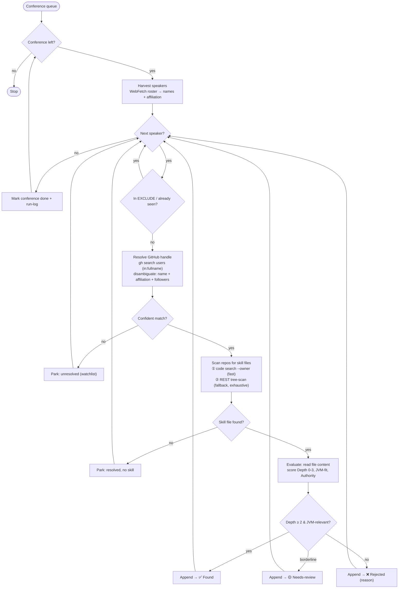
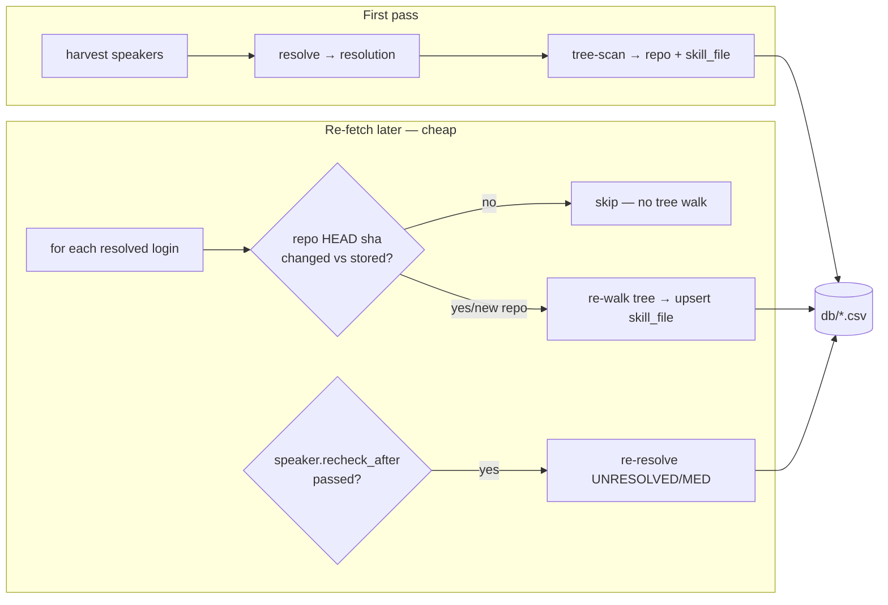

# Speaker → GitHub → SKILL.md Scout — Loop Design

**Goal:** find AI skills **created by conference speakers**. For each speaker, resolve their GitHub
profile via **GitHub user search** (not speaker pages — those are inconsistent), scan **all** their
repos for skill files (`SKILL.md` / `AGENTS.md` / `CLAUDE.md` / `.cursor/rules`), then evaluate each
hit. Output a reviewable candidate list. Only **existing, created** skills — no blog-distilling.

## Flow



## Stages

| # | Stage | Tooling | Output |
|---|---|---|---|
| 1 | **Harvest speakers** | `WebFetch` the roster page | `[ {name, affiliation} ]` |
| 2 | **Resolve GitHub** | `gh api search/users -f q="<name> in:fullname"` → enrich top N with `gh api users/<login>` (name, company, followers, bio) | `{name → login, confidence}` |
| 3 | **Scan for skills** | ① `gh search code --owner=<login> --filename=SKILL.md` (+ AGENTS.md/CLAUDE.md). ② Fallback: `gh repo list` + `git/trees?recursive=1` grep | `[ {repo, path} ]` |
| 4 | **Evaluate** | `gh api .../contents/<path>` → read; score | Found / Needs-review / Rejected |
| 5 | **Record** | Edit `candidates.md` | updated artifact + run-log |

## Disambiguation rule (Stage 2 — the riskiest step)

For each `gh search users` candidate, accept the match when **either**:
- GitHub `name` contains the speaker's first **and** last name token, **or**
- GitHub `company`/`bio` matches the speaker's affiliation (e.g. "Broadcom", "AWS").

Among accepted matches, pick the **highest followers**. If none accept → **unresolved** (park, don't guess).

## State / dedupe
- EXCLUDE = every `repo:`/`author:` in `skills/**/*.yaml`.
- seen = everything already in `candidates.md` (Found / Needs-review / Parked / Rejected).
- Never re-resolve or re-evaluate a seen speaker/repo.

## Loop control
- **Outer:** one conference per iteration (resumable, bounded).
- **Inner:** fan out over that conference's speakers (parallelizable).
- **Stop:** conference queue empty.

## Open questions the trial must answer
- **Q1 (precision):** does `gh search users` + the disambiguation rule pick the *correct* handle? Measure against 6 speakers with known-correct handles.
- **Q2 (recall):** does code-search `--owner` miss skill files in unindexed repos vs. the REST tree-scan? Decide primary vs. fallback.
- **Q3 (cost):** rate-limit budget — `search/users` (30/min) for resolution, `code_search` (10/min) for scanning. How to batch.

## Rate-limit notes (learned)
- `search` bucket = 30/min (user/repo search); `code_search` bucket = 10/min (code search). Separate.
- Batch skill-file scans via repeated `--owner` in one code-search call (~20 owners/call).
- Use `--filename=`, **not** the `path:` query qualifier (latter doesn't match reliably).
- A suppressed 403 looks like "no results" — always check `gh api rate_limit` before trusting empties.

---

## Trial results (2026-06-26, 6 speakers w/ known-correct handles)

**Q1 — resolution precision: 4/6 correct on the top match.**

| Speaker | Affiliation | Top match | Correct? | Decided by |
|---|---|---|---|---|
| Josh Long | Broadcom | `joshlong` | ✅ | name + co "Spring team" + 10k flw |
| James Ward | AWS | `jamesward` | ✅ | name + **co `@aws` = affiliation** (beat 3 other "James Ward"s) |
| Mark Pollack | Broadcom | `markpollack` | ✅ | name + co VMware + 483 flw (beat `mpollack360`, 0 flw) |
| Sébastien Deleuze | Broadcom | `sdeleuze` | ✅ | name + **co Broadcom** |
| Matej Nedić | Infinum | — *(no hits)* | ❌ | accented `ć` + `in:fullname` → empty |
| Daniel Garnier-Moiroux | Broadcom | — *(no hits)* | ❌ | handle `Kehrlann`; GitHub name ≠ real name |

**Takeaways:**
- When a speaker uses their real name on GitHub, `in:fullname` + **disambiguate by affiliation, then
  followers** is reliable — even for common names. Affiliation is the key signal; followers is the tiebreak.
- **Failure A (recoverable):** accents/special chars break `in:fullname`. → add an accent-stripped retry.
- **Failure B (irreducible):** pseudonymous handle (name ≠ real name). → **park as unresolved**; optionally
  recover via the speaker page's GitHub/X/blog link as a *secondary* fallback (rare; ~1/6 here).

**Q2 — scan step works.** Batched `--owner` code-search across the 4 resolved + `MatejNedic` returned
**0 skill files** — none of these speakers ship one. (Consistent with the broader finding that *individual*
speakers rarely publish skills; the value is exhaustive coverage across the whole roster, not any one name.)

**Q3 — cost.** ~1–3 `search/users` calls per speaker (cascade) + `users/<login>` enrich (core bucket,
cheap) + 1 batched code-search per ~20 owners. 85 speakers ≈ ~120 search-bucket calls (~4 min paced) +
~5 code-search calls.

## Updated resolution — v2 (cascade + confidence gate)

```
resolve(name, affiliation):
  candidates = search_users(q = name + " in:fullname")          # 1) exact
  if empty: candidates = search_users(q = strip_accents(name) + " in:fullname")   # 2) accent-stripped
  if empty: candidates = search_users(q = name)                 # 3) broad (name/bio/login)
  if empty: return UNRESOLVED                                   # → park (Failure B)
  for c in candidates: enrich c with users/<login> (name, company, bio, followers)
  accepted = [ c for c in candidates if
                 name_tokens ⊆ c.name        # first AND last name appear, OR
                 OR affiliation ~ c.company/c.bio ]
  if accepted: return max_by(followers, accepted)              # HIGH if both match, else MED
  return UNRESOLVED   # never accept an unvalidated top result (avoids "Josh Rickard" for "Josh Long")
```

**Confidence:** HIGH = name+affiliation match; MED = name-only or affiliation-only; UNRESOLVED otherwise.
Only HIGH/MED proceed to the scan stage; UNRESOLVED → Parked watchlist.

## Decisions — v3 (revised after Phase-1 trial)

The Phase-1 trial (`candidates.trial.md`) overturned two v2 assumptions:

1. **Scan = REST tree-scan is PRIMARY.** ~~code-search `--owner`~~ has **unacceptable recall** — it
   returned 0 for `tzolov`/`antonarhipov`/`lordofthejars` while tree-scan found 13★/14★ skill repos
   (code-search skips forks, subdir files, and unindexed/new repos). Tree-scan: `gh api users/<h>/repos`
   (exclude forks, top ~30 by pushed) → `git/trees?recursive=1` grep for skill files. Code-search is at
   most a cheap pre-filter, never authoritative.
2. **Throttle the tree-scan** (~0.7s between tree calls). Bulk scanning trips a GitHub **secondary rate
   limit** → false "0 repos". Throttle or backoff on empty bursts.
3. **Resolution: auto-accept HIGH only.** All HIGH matches across both trials were correct; every FP/
   unconfirmed case was MED → MED goes to manual-confirm, never auto-scanned.
   **Affiliation signal = the candidate's own GitHub `company`/`bio`** (decided — no external lookup).
   HIGH = name match AND (roster affiliation appears in GH company/bio, **or** one dominant name-match:
   non-empty company + followers ≫ runner-up ≈3×). Accepted trade-off: experts who don't list an
   employer on GitHub (e.g. `danvega`) stay MED/manual rather than auto-accepted. Rosters that omit
   affiliation (e.g. Devnexus) therefore lean on the followers-dominance rule + manual confirm.
4. **Evaluation must filter** forks, demo/talk/workshop repos, and duplicated boilerplate templates
   (e.g. the repeated `01-spec…06-execute` SDD set); keep original, reusable, JVM-relevant skills only.
5. **Granularity:** one conference per outer iteration; throttled tree-scan per resolved speaker.
6. **No guessing, no distilling.** Unresolved / no-skill / demo-only → park or reject, never fabricate.

> **Correction to earlier claim:** my prior "conferences yield 0 created skills" was an artifact of the
> broken code-search scan. With tree-scan, even a 15-speaker slice yielded 2 strong created skills
> (`antonarhipov/agentskills`, `lordofthejars/java-migration-modernization-bob`). Conferences *are* a
> productive source when scanned correctly.

---

## Ledger + data store (system of record) & re-fetch

The loop persists everything to **git-tracked CSV** (`db/*.csv`, documented in `db/README.md`). Plain
text → diffable in PRs, greppable, no binary, no dependency. `candidates.md` is a **generated human
view**. CSV (not SQLite) because the dataset is small (hundreds of rows) and the repo values reviewable
text; the only things a DB simplifies — upserts and the "what changed" query — are a few lines of code
here. (Query ad-hoc with DuckDB-over-CSV or awk; no import step.) The store exists because the trials
proved *most speakers have no skill today but may publish later* — so we avoid re-work and **re-fetch
cheaply** over time.

Files (joined by natural keys `norm_name` / `login` / `repo`): `conferences`, `speakers`,
`speaker_conferences`, `resolutions`, `repos`, `skill_files`, and the append-only `runs` **ledger**.



**Re-fetch rules (incremental):**
- **Repos:** store `head_sha` + `last_scanned_at` per row in `repos.csv`. On re-fetch, list the login's
  repos and compare current HEAD `sha`/`pushed_at` to the stored value — **only re-walk changed/new
  repos**. A speaker with no pushes since last scan costs ~1 list call, zero tree walks.
- **Resolutions:** `recheck_after` (e.g. +90d) retries UNRESOLVED/MED speakers later (handles get created;
  names get added to profiles). HIGH resolutions are permanent unless the login 404s.
- **Speakers:** dedupe by `norm_name`; a new conference appends a `speaker_conferences` link (no re-resolve).
- **Upsert-by-key in loop code** (check the natural key → update-in-place or append): keys are
  `speakers.norm_name`, `repos.(login,name)`, `skill_files.(login,repo,path)` — re-running never duplicates.

All CSVs are committed (the reviewable source of truth) alongside the generated `candidates.md`.
